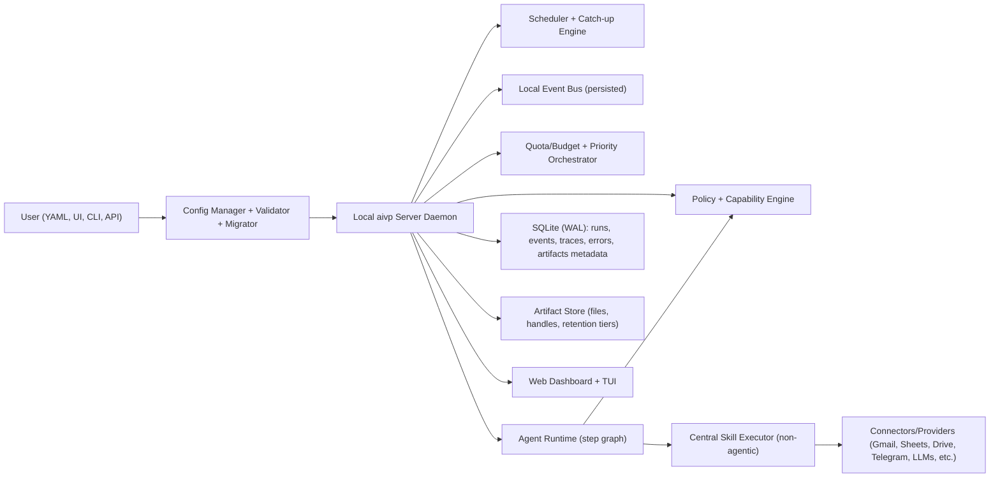

# aivp v1 System Design (Locked)

Status: Draft for implementation  
Date: 2026-02-26  
Scope: Local-first single-user framework for "AI VPs" on laptops (macOS first, Linux close second)

## 1. Product Characterization

- External framing: task-bounded local automation OS.
- Internal architecture stance: capability-secure agent runtime.
- Core goal: make narrowly scoped, safer mini-agents easy to define in YAML, run locally, and operate with least privilege.
- Non-goal: a single broad "personal super-assistant" with unrestricted capabilities.

## 2. High-Level Architecture



## 3. Runtime Model

- Service lifecycle: background daemon with optional auto-start on login.
- Execution boundary: each run executes in a subprocess by default.
- Agent workflow model: declarative step graph in YAML (`steps`, `conditions`, `on_error`).
- Overlap policy: configurable per-agent; default single-flight (no overlap).
- Inter-agent communication: persisted event bus with topics/subscriptions, not direct calls.
- Event contracts: versioned schemas per event type.
- Memory: per-agent scoped state store by default; optional shared knowledge/memory spaces.

## 4. Capability and Safety Model

- Permission baseline: enforced capability tokens/checks in runtime, not prompt-only controls.
- Enforcement location: central policy layer + central skill executor.
- Skill usage pattern: agents request allowed registered skills with constrained parameters; server executes non-agentically using stored secrets.
- Policy precedence: explicit `deny` always wins; then nearest-scope `allow`.
- Approval model: policy DSL by action/resource/risk with per-agent "no-ask" override support.
- Risk flow: policy-triggered plan/preview before high-risk actions.
- Network egress: deny by default; explicit per-skill/domain allowlists.
- Sensitive data handling: field-level sensitivity tags + redaction in UI/logs/exports.
- Irreversible actions: extra guardrail policies (preview/cooldown/explicit mode).
- Agent uncertainty: explicit `ABSTAIN` outcome with reason + escalation path.

## 5. Configuration and Contracts

- User-facing config: YAML-first, Python-extensible.
- Schema discipline: `schema_version` required with migration tooling.
- Strictness: strict validation by default; optional dev-mode leniency.
- Config lifecycle: draft -> validate -> activate with rollback on invalid configs.
- Modularity: YAML include/import support (no full macro engine in v1).
- Conflict handling: file-backed source of truth with revision checks + write locks.
- Prompt governance: versioned prompt artifacts pinned per run.
- Structured outputs: schema validation + retry/repair loop.
- Skill contracts: Python-first typed models (Pydantic) with exported JSON Schema.
- Parameter constraints: declarative schema constraints enforced pre-exec (enum/range/pattern/date windows).
- Compatibility checks: block activation when contract changes broaden/break permissions unexpectedly.

## 6. Scheduling, Triggers, and Catch-up

- Time model: wall clock with monotonic guardrails for sleep/wake/drift recovery.
- Timezone scope: per-agent timezone support.
- Trigger model: schedule + event predicate DSL in YAML.
- Missed run recovery: bounded replay window, max-runs controls, jitter, and bounded drain rate.
- Replay order: oldest missed windows first.
- Freshness policy: stale backlog can be dropped by policy rules.
- Delivery guarantee: at-least-once event delivery with idempotency keys.

## 7. Reliability and Failure Semantics

- Idempotency: mandatory idempotency keys for mutating operations.
- Failure model: per-step/per-group saga compensation where meaningful.
- Retry strategy: per-skill retry/backoff/circuit-breaker policies.
- Dead letters: failed events/runs route to dead-letter queue with replay tooling.
- Replay tooling: filtered bulk replay with preview/dry-run.
- Timeouts: per-step and per-run budgets; escalating cancellation/kill policy.
- Incident controls: scoped pause, emergency denylist, and kill switch.
- Offline behavior: queue + retry with TTL and stale-run rules.

## 8. Cost, Quotas, and LLM Routing

- Quota arbitration: priority + token buckets + anti-starvation aging.
- Budget hierarchy: provider + skill + agent levels with inheritance/overrides.
- UX default: provider-level budgeting should be simple and sufficient for most users.
- Rate-limit adaptation: static caps plus adaptive handling from provider `429` and headers.
- Cap-hit behavior: priority-based degradation (pause/defer lower-priority workloads first).
- Model routing: policy-driven routing by cost/latency/quality/risk, with fallback; optional fixed model per agent.
- Context policy: explicit per-step context allowlist (least-context default) plus minimization filters/token budget controls.

## 9. Data, Storage, and Privacy

- Primary persistence: single SQLite database in WAL mode.
- Observability storage: structured runs/events/step traces with correlation IDs.
- Trace granularity: run + step + skill-call.
- Artifact flow: out-of-band artifact handles with scoped access and TTL.
- Artifact lifecycle: retention tiers + dedupe/compression + GC.
- Prompt/response storage default: enabled with redaction policies.
- Retention defaults: policy-based retention + sensitive-field redaction.
- DB encryption: optional (keychain/passphrase), not mandatory in v1.
- Backup/restore: built-in signed export/import bundles with checksums.
- Audit export: signed tamper-evident bundles plus plain JSON/CSV exports.

## 10. Secrets and Integrations

- Secrets backend: OS keychain/keyring by default.
- Allowed override: users may supply tokens through env vars/config where needed.
- Runtime secret access: resolved just-in-time per skill execution scope.
- Principle: agents should not directly receive broad secrets; server executor uses secrets to run allowed skills.
- Connector resilience: proactive connector health checks + token expiry detection + alerting.

## 11. Interfaces and UX

- Local dashboard auth: optional but enabled by default.
- Local control API: localhost HTTP API with token auth + scoped permissions.
- Dashboard performance: precomputed summaries/materialized views + lazy drill-down.
- Alerts: rule-based severity/channel/cooldown policy.
- First-run UX: guided setup wizard + starter templates.
- Starter templates: curated, versioned local templates with required provenance metadata.
- Template/skill provenance manifest: source, version/hash, license, permission scope.

## 12. Packaging, Platform, and Extensibility

- Python support: last 2-3 stable versions (target 3.11-3.13).
- Dependency policy: locked dependencies for runtime/core/templates.
- Distribution (v1): `pip`/CLI first.
- Future packaging: macOS app bundle + launch agent (post-v1).
- User model (v1): single-user only.
- Future user model: multi-profile isolation.
- Plugin strategy: versioned extension API with capability flags.
- Release channels: stable + opt-in beta.
- Update channel for integrations/skills: signed update feed with explicit user approval.

## 13. Testing and Operability

- Safe testing mode: dry-run with side-effect mocks and preview diffs.
- Deterministic mode: virtual clock + mocked connectors + replay fixtures.
- Custom skill DX: typed SDK + scaffold command + local harness.
- Skill quality gate (v1): no mandatory tests.
- Future gate: require contract tests for mutating skills.
- Optional SLO model: per-agent SLO targets with degrade behavior.

## 14. Recommended Repo Layout (initial)

```text
docs/
  coding-agents/
    aivp-v1-system-design.md
    decision-register.md              # optional split if this file grows
config/
  schemas/
  migrations/
skills/
  builtin/
agents/
  templates/
runtime/
  db/
  artifacts/
  backups/
```

## 15. Minimal v1 Build Sequence

1. Config core: schema versioning, strict validation, includes, draft/activate pipeline.
2. Runtime core: daemon, scheduler/catch-up, event bus, subprocess run engine.
3. Security core: policy DSL, capability checks, deny precedence, central skill executor.
4. Reliability core: idempotency keys, retry/backoff, dead letters, replay/dry-run.
5. LLM/core economics: routing policy, quotas/token buckets, budget hierarchy, degradation rules.
6. Observability: structured traces, dashboards, alerts, signed audit export.
7. UX: setup wizard, starter templates, CLI/TUI/dashboard controls.

## 16. Decision Register (Locked)

### 1-15 Foundations

- D001 `B` subprocess per run.
- D002 `B` capability-token enforcement (skill-mediated constraints).
- D003 `C` Pydantic contracts + JSON Schema export.
- D004 `B` declarative step graph.
- D005 `C` event-sourcing style idempotency for mutating actions.
- D006 `C` bounded catch-up replay.
- D007 `C` resource locks/leases for shared mutable resources.
- D008 `C` policy-driven approvals, with per-agent no-ask option.
- D009 `C` retries/backoff/circuit-breakers + dead letters.
- D010 `B` keychain default; env/config token input allowed.
- D011 `B` schema version + migration CLI.
- D012 `B` structured observability in SQLite (OTel later).
- D013 `B/C` external positioning B, internal architecture C.
- D014 `A+B` local files plus Git-based distribution/pinning.
- D015 `C` routing policy with optional fixed-per-agent model.

### 16-25 Core Platform

- D016 `A` single SQLite (WAL).
- D017 `B` at-least-once delivery + idempotency.
- D018 `B` per-agent timezone.
- D019 `B` hot-reload via validate+rollback activation flow.
- D020 `C` priority + token buckets + anti-starvation.
- D021 `C` per-step/per-run timeout budgets.
- D022 `B` YAML policy DSL.
- D023 `B` skill lockfile/hash pinning.
- D024 `B` dry-run preview mode.
- D025 `B` retention + redaction defaults.

### 26-35 Service and Control Plane

- D026 `B` daemon + optional auto-start.
- D027 `B` persisted event bus.
- D028 `B` versioned event schemas.
- D029 `B` per-skill/provider virtual env isolation.
- D030 `B` scoped per-agent memory + optional shared spaces.
- D031 `B` localhost auth optional but on by default.
- D032 `B` localhost HTTP API with token/scopes.
- D033 `B` rule-based alerting.
- D034 `B` built-in backup/export-import bundles.
- D035 `B` explicit upgrade command with rollback snapshot.

### 36-45 Safety and Guardrails

- D036 `C` strict config by default + dev leniency mode.
- D037 `C` deny-wins precedence.
- D038 `B` risk-based preview before execution.
- D039 `C` overlap configurable; default single-flight.
- D040 `B` catch-up oldest-first.
- D041 `C` saga compensation model.
- D042 `B` YAML include/import support.
- D043 `A` no mandatory skill tests in v1 (future B).
- D044 `C` deny-by-default egress allowlists.
- D045 `B` sensitivity tags + redaction.

### 46-55 Governance and Product Shape

- D046 `B` versioned/pinned prompts.
- D047 `B` schema-enforced structured outputs.
- D048 `B` priority-based degradation when caps hit.
- D049 `B` queue+retry with TTL/staleness handling.
- D050 `B` signed update feed + explicit approval.
- D051 `B` semver + deprecation windows + migration hints.
- D052 `B` run/step/skill-call trace granularity.
- D053 `B` auto-remediation policies (pause/reduce/route alerts).
- D054 `A` single-user only in v1 (future B).
- D055 `A` pip/CLI packaging in v1 (future B).

### 56-65 Runtime Integrity

- D056 `B` wall clock + monotonic guardrails.
- D057 `B` file source-of-truth + revision conflict checks.
- D058 `B` explicit telemetry opt-in prompt in onboarding.
- D059 `B` prompt/response storage on by default with redaction.
- D060 `B` just-in-time scoped secret resolution via server executor.
- D061 `B` immutable run snapshot (config/prompt/skill/policy hashes).
- D062 `B` versioned plugin API with capability flags.
- D063 `B` optional local DB encryption.
- D064 `B` scoped incident pause + denylist + kill switch.
- D065 `B` guided setup wizard + starter templates.

### 66-75 Agent-Skill Boundary

- D066 `B` central non-agentic skill executor.
- D067 `B` pre-exec declarative parameter constraints.
- D068 `B` structured evidence/provenance refs in outputs.
- D069 `B` artifact handles with scoped access + TTL.
- D070 `B` budget hierarchy with provider-level-first UX.
- D071 `B` bounded backlog drain + freshness cutoffs.
- D072 `B` schedule + event predicate DSL.
- D073 `B` typed SDK + local harness + scaffold.
- D074 `B` materialized summaries for dashboard performance.
- D075 `B` per-step context allowlist (least-context default).

### 76-85 Operability and Evolution

- D076 `B` draft/validate/activate rollout with rollback.
- D077 `B` compatibility gate on widening/breaking contract changes.
- D078 `B` global + per-run CPU/memory/time caps.
- D079 `B` static caps + adaptive provider rate-limit handling.
- D080 `B` filtered bulk replay with preview.
- D081 `B` configurable paths for DB/log/artifacts/backups.
- D082 `B` policy authorization before every tool/skill call.
- D083 `B` policy-based data minimization before prompt assembly.
- D084 `B` signed tamper-evident audit bundles + plain exports.
- D085 `B` curated versioned local starter templates.

### 86-95 Additional Locked Decisions

- D086 `B` support last 2-3 Python versions.
- D087 `B` lock dependencies for runtime/core/templates.
- D088 `B` deterministic mode (virtual clock + mocks + fixtures).
- D089 `B` proactive connector health/token lifecycle checks.
- D090 `B` extra safeguards for irreversible actions.
- D091 `B` explicit ABSTAIN contract.
- D092 `B` optional per-agent SLO targets.
- D093 `B` artifact retention tiers + dedupe/compression + GC.
- D094 `B` stable + opt-in beta channels.
- D095 `B` required provenance manifest for skills/templates.

## 17. Deferred/Future Upgrades Already Agreed

- D012 future: OpenTelemetry export integration.
- D043 future: require contract tests for mutating skills.
- D054 future: multi-profile isolation.
- D055 future: macOS app bundle packaging.

## 18. Implementation Notes for Coding Agents

- Treat this document as normative for v1 unless a new decision supersedes an item.
- Prefer server-enforced safety to prompt-level safety.
- Any connector or skill implementation must explicitly declare:
  - input schema/constraints,
  - permission scope,
  - secret references,
  - idempotency behavior for mutating actions,
  - retry/backoff policy,
  - audit evidence fields.
- When in doubt, fail closed (deny) and emit actionable error metadata.
